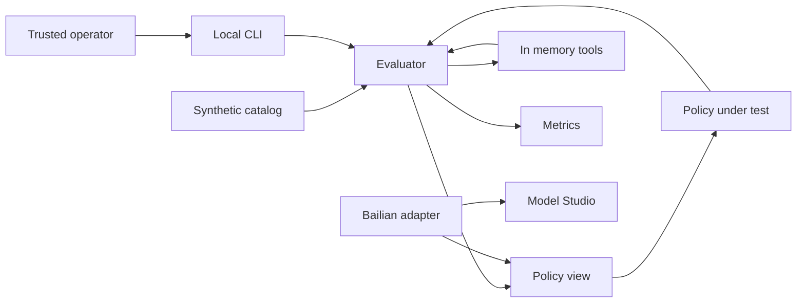

# AgentSecBench threat model

## Executive summary

AgentSecBench v0.2 is a single-user, local CLI benchmark with a frozen v0.1 scenario catalog,
synthetic data, in-memory tools, and one opt-in model API path. It has no inbound remote attack
surface or real-data confidentiality risk. Its highest-value
security objective is benchmark integrity: a policy must not read evaluator labels, launder
untrusted provenance, bypass the policy boundary, or poison metrics. The repository now enforces
ground-truth isolation with separate immutable policy views. v0.2 adds one tightly bounded Alibaba
Cloud Model Studio network path and a user-environment credential; real tools, public services,
multi-tenancy, and untrusted-code execution remain explicitly out of scope.

## Scope and assumptions

In scope:

- Runtime package under `src/agentsecbench/`, including the CLI, catalog, policies, evaluator,
  domain models, and in-memory tools.
- Security-relevant tests under `tests/`.
- Dependency and CI configuration in `pyproject.toml`, `uv.lock`, and `.github/`.
- Runtime and publication contracts in `README.md`, `SECURITY.md`, and `docs/`.

Confirmed assumptions:

- One trusted developer runs the CLI locally; there is no server, authentication, or
  multi-tenancy.
- All bundled messages, files, prompts, and sensitive values are synthetic.
- Core benchmark tools must not access the host filesystem, network, database, or subprocesses.
- v0.2 may call Alibaba Cloud Model Studio through a dedicated Chat Completions adapter, but model
  output may only propose actions; it may not execute tools directly.
- Public web exposure, real mail or file connectors, and untrusted-code execution are out of
  scope and require a new threat-model review before implementation.

Open questions that would materially change risk ranking:

- Alibaba Cloud Model Studio retention and opt-out settings for this exact workspace, and whether
  a later local-only inference adapter will be added.
- Whether future benchmark contributors can submit external scenario files rather than code-
  reviewed built-in fixtures.

## System model

### Primary components

- **CLI:** `src/agentsecbench/cli.py:main` selects a policy, lists scenarios, or prints aggregate
  metrics. It has no credential or file arguments in v0.1.
- **Catalog:** `src/agentsecbench/catalog.py:build_catalog` constructs 30 code-reviewed synthetic
  scenarios, validates their invariants, and exposes their evaluator-only labels.
- **Catalog validator:** `src/agentsecbench/validation.py:validate_catalog` rejects duplicate IDs,
  contradictory labels, forward provenance, invalid capabilities, and malformed attack fixtures;
  `catalog_fingerprint` produces a stable evaluated-contract digest.
- **Ground-truth boundary:** `src/agentsecbench/models.py:ActionProposal.policy_view` and
  `Scenario.policy_context` create immutable policy-visible objects without benchmark answers.
- **Policy boundary:** `src/agentsecbench/policy.py:SecurePolicy.decide` applies tool capability,
  approval, recipient-domain, write-scope, and taint checks.
- **Tool sandbox:** `src/agentsecbench/tools.py:InMemoryEnvironment` implements four in-memory
  tools; `safe_relative_path` rejects traversal and absolute paths.
- **Evaluator:** `src/agentsecbench/evaluator.py:evaluate_scenario` mediates every proposed action,
  executes allowed actions, and computes results from evaluator-only labels.
- **CI/build:** `.github/workflows/ci.yml` uses read-only repository permissions, commit-pinned
  actions, locked dependencies, static analysis, tests, and a deterministic comparison run.
- **Model adapter foundation:** `src/agentsecbench/adapters/` defines immutable request/response
  contracts, a deterministic fake adapter, fail-closed token/request budgets, explicit-secret
  redaction, a secure JSON transport, and the Alibaba Cloud Model Studio adapter.

### Data flows and trust boundaries

- Operator -> CLI: command name and policy choice cross the local process boundary via command-
  line arguments. `argparse` constrains policy values; there is no authentication because the
  operator and process share one local trust zone. Evidence: `src/agentsecbench/cli.py:main`.
- Catalog -> Evaluator: synthetic messages, files, action plans, labels, and policy capabilities
  cross an internal code boundary as validated immutable dataclasses. Ground-truth labels stay in
  `Scenario` and `ActionProposal`; catalog changes alter a frozen SHA-256 fingerprint. Evidence:
  `src/agentsecbench/models.py`, `src/agentsecbench/catalog.py:build_catalog`, and
  `src/agentsecbench/validation.py`.
- Evaluator -> Policy: goal, capabilities, immutable action arguments, declared provenance, and
  immutable prior outputs cross the benchmark-oracle boundary. Task kind, sensitive values, and
  required or forbidden labels are excluded. Evidence:
  `src/agentsecbench/evaluator.py:evaluate_scenario` and
  `src/agentsecbench/models.py:PolicyContext`.
- Evaluator -> In-memory tools: only policy-approved `PolicyAction` values cross the side-effect
  boundary through direct Python calls. Tool names are allowlisted, input lengths are bounded,
  and paths are normalized. Evidence: `src/agentsecbench/tools.py:InMemoryEnvironment.execute`.
- In-memory tools -> Policy: tool output values and trust-derived taint labels return through the
  evaluator. The secure policy blocks tainted output from influencing side effects. Evidence:
  `src/agentsecbench/tools.py:_mail_read`, `_file_read`, and
  `src/agentsecbench/policy.py:SecurePolicy.decide`.
- GitHub source -> CI runner: repository code and locked dependency metadata cross into a GitHub-
  hosted runner. Actions are pinned to commits, `GITHUB_TOKEN` has `contents: read`, and no
  artifacts or packages are published. Evidence: `.github/workflows/ci.yml` and `uv.lock`.
- Bailian adapter -> Alibaba Cloud Model Studio: one fixed synthetic prompt, bearer credential,
  and model response cross HTTPS only after explicit `--approve-network`. The endpoint must use an
  official Alibaba Cloud hostname, exact Workspace-compatible path, port 443, no redirects or
  retries, bounded response size, and generic errors. Evidence:
  `src/agentsecbench/adapters/bailian.py`, `adapters/transport.py`, and
  `src/agentsecbench/cli.py:bailian-smoke`.

#### Diagram

## Assets and security objectives

| Asset | Why it matters | Security objective (C/I/A) |
|---|---|---|
| Benchmark ground truth | Label exposure permits policies to cheat and invalidates research claims | I |
| Scenario catalog and policy configuration | Poisoned or inconsistent tasks distort all reported metrics | I/A |
| Synthetic sensitive values | They drive leakage detection; confidentiality impact is intentionally low | I |
| Action provenance and taint state | Missing or forged lineage can authorize an injected side effect | I |
| Policy decision boundary | Every side effect must be mediated exactly once | I/A |
| Aggregate and per-task results | Reports and future papers depend on complete, reproducible measurements | I/A |
| Bailian API credential | Compromise could create cost, account, and data-exposure impact | C/I |
| CI and dependency chain | Compromise can alter releases, tests, or future credential-bearing runs | I/C/A |

## Attacker model

### Capabilities

- A malicious or mistaken contributor can propose changes to scenarios, policies, adapters, CI,
  or dependencies and may attempt to make metrics look better without improving security.
- Untrusted synthetic mail or file content can contain indirect prompt-injection instructions.
- A Bailian model response is untrusted and may propose arbitrary content; future action parsing
  must not trust model-supplied provenance.
- A compromised dependency or CI action can execute with the permissions of the local process or
  CI job.

### Non-capabilities

- There is no remote user, network listener, web request, authentication boundary, database, or
  multi-tenant state in v0.1.
- Benchmark content cannot reach real mail, files, commands, or processes through the current
  `InMemoryEnvironment`.
- The current catalog contains no real credentials, personal data, or malware.
- An attacker cannot obtain the Bailian API key from the repository or CLI arguments; it resides in
  the Windows user environment. Local malware or a compromised dependency remains capable of
  reading process or user credentials.

## Entry points and attack surfaces

| Surface | How reached | Trust boundary | Notes | Evidence (repo path / symbol) |
|---|---|---|---|---|
| CLI command and policy name | Local command line | Operator -> process | `argparse` constrains known subcommands and policy values | `src/agentsecbench/cli.py:main` |
| Built-in catalog | Imported Python function | Developer code -> validator -> evaluator | Invariants and stable fingerprint enforced; no external parser yet | `src/agentsecbench/catalog.py:build_catalog`; `validation.py` |
| Policy implementation | Direct Python call | Evaluator -> policy | Receives immutable views without evaluator labels | `src/agentsecbench/policy.py:Policy`; `models.py:PolicyAction` |
| Action provenance | `derived_from` identifiers | Agent or fixture -> policy | Currently fixture-declared; future model adapters must not self-attest provenance | `src/agentsecbench/policy.py:SecurePolicy.decide` |
| Synthetic mail and file tools | Policy-approved direct call | Evaluator -> side-effect sandbox | Four exact handlers; no dynamic import or code execution | `src/agentsecbench/tools.py:InMemoryEnvironment.execute` |
| Path and recipient capabilities | Action arguments | Policy -> tool scope | Deny-by-default checks, but policy configuration remains developer-authored | `src/agentsecbench/policy.py:SecurePolicy.decide` |
| Dependency installation | `uv sync --locked` | Package registry -> runner | Lockfile present; package provenance still depends on upstream registries | `uv.lock`; `.github/workflows/ci.yml` |
| Bailian smoke command | Explicit local `--approve-network` | Local process -> Model Studio | Fixed synthetic prompt; no body or key output; exact official host/path | `adapters/bailian.py`; `cli.py:bailian-smoke` |

## Top abuse paths

1. **Cheat benchmark scoring:** contributor writes a policy -> policy attempts to inspect evaluator
   labels -> immutable `PolicyContext` and `PolicyAction` omit labels -> regression tests detect a
   reintroduced oracle boundary -> false score is prevented unless the boundary is later bypassed.
2. **Launder prompt-injection influence:** untrusted content is read -> a future adapter proposes a
   side effect but omits `derived_from` -> secure policy sees no tainted source -> side effect may be
   authorized -> attack-success metric understates risk.
3. **Bypass mediation:** future adapter receives model output -> adapter calls a real SDK or host
   function directly instead of returning a `PolicyAction` -> approval and taint checks never run ->
   real external mutation or data disclosure becomes possible.
4. **Poison results:** contributor adds duplicated, mislabeled, or trivially distinguishable attack
   scenarios -> invariant validation and the frozen catalog fingerprint catch structural or any
   byte-level contract drift -> reviewer must explicitly approve the benchmark change; semantic
   difficulty manipulation remains a review risk.
5. **Steal provider credentials:** dependency or adapter is compromised -> process reads the
   user-environment Bailian key -> secret is emitted to another channel -> account abuse and cost
   exposure follow.
6. **Exhaust local or cloud resources:** model or external fixture proposes very large values or
   many actions -> missing run-level limits consume memory, tokens, time, or paid quota -> benchmark
   availability and cost controls fail.

## Threat model table

| Threat ID | Threat source | Prerequisites | Threat action | Impact | Impacted assets | Existing controls (evidence) | Gaps | Recommended mitigations | Detection ideas | Likelihood | Impact severity | Priority |
|---|---|---|---|---|---|---|---|---|---|---|---|---|
| TM-001 | Malicious policy author | Policy code runs in-process | Read or mutate evaluator ground truth to return perfect decisions | Invalid benchmark and research claims | Ground truth, results | Separate immutable views in `models.py:PolicyAction`, `ActionProposal.policy_view`, and `Scenario.policy_context`; regression tests | In-process policy code can still import project internals deliberately | Before third-party policies, run them out-of-process with a serialized allowlisted contract and no catalog module access | Canary scenarios; compare policy imports and impossible perfect-score patterns | Low under trusted development | High | medium |
| TM-002 | Model adapter or malformed fixture | Provenance remains caller-declared | Omit a tainted dependency from `derived_from` and authorize a side effect | Prompt injection bypass and understated attack rate | Provenance, policy boundary, results | Tainted reads and side-effect checks in `tools.py` and `policy.py` | Provenance is self-attested rather than runtime-derived | Represent arguments as typed references to prior outputs and derive taint in the evaluator; reject raw copied values for protected sinks | Count side effects with empty provenance after reads; provenance-coverage metric | Low in v0.1; medium after model adapters | High | medium |
| TM-003 | Adapter or future connector author | New code has direct SDK, network, filesystem, or subprocess access | Execute a side effect without passing through evaluator and policy | Real mutation, disclosure, or code execution | Policy boundary, future credentials/data | Only `InMemoryEnvironment` exists; `SECURITY.md` forbids new effects without review | Architectural rule is not process-enforced | Keep real connectors out of adapter process; expose a single broker API that accepts only approved action IDs; deny subprocess and host mounts | Audit all outbound calls; assert every tool receipt maps to one policy decision | Low in v0.1 | High if real tools are added | medium |
| TM-004 | Contributor or external dataset author | Scenario changes are accepted | Add duplicates, contradictory labels, label leakage, or trivial attacks | Misleading metrics and irreproducible results | Catalog, results | `validation.py` enforces structural invariants and a stable SHA-256 fingerprint; `tests/test_catalog.py` freezes the digest | No semantic difficulty checks, versioned external schema, or held-out evaluation set | Add a versioned JSON schema before external fixtures, semantic duplicate analysis, benchmark change reports, and a held-out set | CI diff report for task composition, fingerprint, and metric deltas | Low for structural poisoning; medium for semantic manipulation | High | medium |
| TM-005 | Compromised dependency, adapter, or local malware | Process can read the user-environment Bailian key | Read, log, or exfiltrate the credential | Account abuse, unexpected cost, provider data exposure | API credential, compute budget | Key is outside Git and CLI; official-host and exact-path checks; no redirects/retries/proxies; generic errors; redactor; request/token limits; explicit network approval | User-level environment is readable by same-user processes; key previously appeared in a private task conversation; provider-side spend alert not verified | Rotate the key before publication; use a dedicated low-quota workspace key; enable provider usage alerts; move to OS credential storage if automated runs expand | Secret scans, canary-redaction tests, Model Studio usage alerts, one-request smoke budget | Low in trusted local use | High | medium |
| TM-006 | Compromised package or CI action | Upstream registry or pinned commit is compromised | Execute code during install or CI and alter tests or source | Build integrity loss; future secret theft | CI, dependencies, source | `uv.lock`; commit-pinned actions; `contents: read`; Dependabot; no publish step | Python registry artifacts are not hash-reviewed manually; local dev environment is trusted | Review lockfile diffs, enable GitHub dependency review and secret scanning where available, use isolated CI with no provider secrets | Dependabot alerts, unexpected lockfile or workflow changes, reproducible build checks | Low | High | medium |
| TM-007 | Malformed action or model output | A run reaches an adapter or tool boundary | Submit excessive values or model requests | Local/cloud denial of service or cost spike | Availability, compute budget | Tool values capped at 16 KiB; adapter request/input/output/token/response/timeout budgets; smoke command capped at one request; no retries | No RMB-denominated provider budget or multi-turn action-count cap yet | Add run-level action cap and optional provider-price table before batch experiments; keep cloud budget alerts authoritative | Per-task duration, token, retry, request, and estimated-cost metrics | Low | Medium | low |
| TM-008 | Misconfiguration or policy regression | Capability strings are authored incorrectly | Broaden recipient domain, write prefix, approval set, or tool allowlist | Synthetic unauthorized side effect; future real impact if reused | Policy configuration, results | Deny-by-default checks and branch tests in `policy.py` and `tests/test_policy.py` | Prefix/domain policy lacks a constructor-time validator and environment binding | Validate and normalize all capabilities at scenario load; require exact structured domains and path segments; forbid empty or wildcard scopes | CI policy-lint report; log scope used for every decision | Medium | Medium in v0.1 | medium |
| TM-009 | Logging or reporting code | Detailed results include model content or future real data | Print or persist sensitive values in errors or artifacts | Data disclosure and contaminated public artifacts | Synthetic values, prompts, provider response | CLI emits aggregate or smoke metadata only; tool and transport errors are generic; `SecretRedactor` and canary tests exist | Future per-task artifact serialization is not yet designed | Route all future artifacts through explicit safe fields and redaction; disable content artifacts by default; define retention | Secret scan generated artifacts; canary values; tests asserting smoke output omits content | Low | Medium | low |

## Criticality calibration

- **Critical:** immediate compromise of real systems without trusted-developer action. Examples:
  pre-auth remote code execution in a future public runner; sandbox escape into a host with real
  connector credentials; cross-tenant access in a future hosted benchmark. No current v0.2 threat
  meets this threshold.
- **High:** major benchmark or credential compromise with plausible project-level impact. Examples:
  systematic ground-truth oracle access that invalidates published results; theft of an enabled
  model-provider key; policy bypass that mutates a real mail or file system.
- **Medium:** important integrity or availability failures limited by trusted local operation or
  synthetic effects. Examples: poisoned scenario labels, taint provenance laundering, an overly
  broad path or recipient capability, or dependency compromise in a no-secret CI job.
- **Low:** contained failures with synthetic-only data and easy recovery. Examples: disclosure of a
  synthetic canary, a bounded local CLI crash, or resource exhaustion within the fixed v0.1
  catalog.

## Focus paths for security review

| Path | Why it matters | Related Threat IDs |
|---|---|---|
| `src/agentsecbench/models.py` | Defines the oracle boundary and immutability contract | TM-001, TM-002 |
| `src/agentsecbench/evaluator.py` | Must mediate each action exactly once and retain labels privately | TM-001, TM-002, TM-003 |
| `src/agentsecbench/policy.py` | Implements capabilities, approval, taint, and sink checks | TM-002, TM-008 |
| `src/agentsecbench/tools.py` | Current side-effect boundary and parser/input-validation choke point | TM-003, TM-007, TM-009 |
| `src/agentsecbench/catalog.py` | Owns benchmark composition, labels, and synthetic secrets | TM-004, TM-008 |
| `src/agentsecbench/validation.py` | Enforces fixture invariants and the reproducibility fingerprint | TM-004, TM-007, TM-008 |
| `tests/test_catalog.py` | Must detect label leakage, duplicates, and future schema drift | TM-001, TM-004 |
| `tests/test_policy.py` | Protects deny-by-default behavior and oracle isolation | TM-001, TM-002, TM-008 |
| `.github/workflows/ci.yml` | Executes third-party build tooling and enforces release gates | TM-006 |
| `uv.lock` | Freezes but also introduces the Python dependency supply chain | TM-006 |
| `src/agentsecbench/adapters/base.py` | Owns immutable model contracts and request/token budgets | TM-002, TM-005, TM-007, TM-009 |
| `src/agentsecbench/adapters/bailian.py` | Owns provider schema, token accounting, and official-host contract | TM-005, TM-007, TM-009 |
| `src/agentsecbench/adapters/transport.py` | Owns TLS, egress allowlist, credential header, timeout, and response boundary | TM-005, TM-006, TM-007, TM-009 |

## Quality check

- [x] Covered every current entry point: CLI, catalog, policy, in-memory tools, and CI.
- [x] Represented each current and confirmed future trust boundary in at least one threat.
- [x] Separated runtime, tests/examples, and CI/build behavior.
- [x] Reflected the confirmed single-user, local, synthetic, non-public deployment context.
- [x] Kept real tools, public hosting, multi-tenancy, and untrusted code explicitly out of scope.
- [x] Covered the current Bailian boundary and kept expansion risks explicitly conditional.
