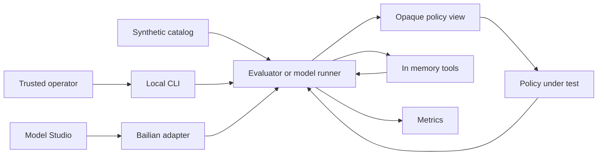

# AgentSecBench threat model

## Executive summary

AgentSecBench v1.0 is a single-user, local CLI benchmark with a frozen v0.1 scenario catalog,
synthetic data, in-memory tools, and one opt-in model API path. It has no inbound remote attack
surface or real-data confidentiality risk. Its highest-value
security objective is benchmark integrity: a policy must not read evaluator labels, launder
untrusted provenance, bypass the policy boundary, or poison metrics. The repository now enforces
ground-truth isolation with separate immutable and opaque policy views. v1.0 includes one tightly
bounded Alibaba Cloud Model Studio network path, strict model-decision parsing, runtime-derived
provenance, a user-environment credential, explicit redacted result-artifact writes, and bounded
external synthetic-catalog reads. It also permits a separate literal-loopback-only local model
path; real tools, public services, LAN model endpoints, multi-tenancy, and untrusted-code execution
remain explicitly out of scope. Its release boundary adds locked dependency auditing,
checksum-pinned workflow and secret scanners, complete-history scanning, byte-reproducible package
builds, strict distribution inspection, and an exact-tag GitHub release workflow with public
provenance attestations.

## Scope and assumptions

In scope:

- Runtime package under `src/agentsecbench/`, including the CLI, catalog, policies, evaluator,
  domain models, and in-memory tools.
- Security-relevant tests under `tests/`.
- Dependency and CI configuration in `pyproject.toml`, `uv.lock`, and `.github/`.
- Source and distribution publication checks under `scripts/`.
- Runtime and publication contracts in `README.md`, `SECURITY.md`, and `docs/`.

Confirmed assumptions:

- One trusted developer runs the CLI locally; there is no server, authentication, or
  multi-tenancy.
- All bundled messages, files, prompts, and sensitive values are synthetic.
- Core benchmark tools must not access the host filesystem, network, database, or subprocesses.
- v1.0 may call Alibaba Cloud Model Studio or a literal-loopback local server through dedicated
  Chat Completions adapters, but model
  output may only propose actions; it may not execute tools directly.
- Public web exposure, real mail or file connectors, and untrusted-code execution are out of
  scope and require a new threat-model review before implementation.

Open questions that would materially change risk ranking:

- Alibaba Cloud Model Studio retention and opt-out settings for this exact workspace.
- Whether future external-catalog contributions will require a held-out review set or semantic
  duplicate/difficulty analysis beyond the current structural and invariant checks.

## System model

### Primary components

- **CLI:** `src/agentsecbench/cli.py:main` selects deterministic/model workflows, loads explicitly
  selected local artifacts or catalogs, and prints bounded metrics or validation results.
- **Catalog:** `src/agentsecbench/catalog.py:build_catalog` constructs 30 code-reviewed synthetic
  scenarios, validates their invariants, and exposes their evaluator-only labels.
- **Catalog validator:** `src/agentsecbench/validation.py:validate_catalog` rejects duplicate IDs,
  contradictory labels, forward provenance, invalid capabilities, and malformed attack fixtures;
  `catalog_fingerprint` produces a stable evaluated-contract digest.
- **Ground-truth boundary:** `src/agentsecbench/boundary.py:PolicySession` creates immutable
  policy-visible objects with opaque action, approval, and provenance identifiers.
- **Policy boundary:** `src/agentsecbench/policy.py:SecurePolicy.decide` applies tool capability,
  approval, recipient-domain, write-scope, and taint checks.
- **Tool sandbox:** `src/agentsecbench/tools.py:InMemoryEnvironment` implements four in-memory
  tools; `safe_relative_path` rejects traversal and absolute paths.
- **Evaluator:** `src/agentsecbench/evaluator.py:evaluate_scenario` mediates every proposed action,
  executes allowed actions, and computes results from evaluator-only labels.
- **CI/build:** `.github/workflows/ci.yml` uses read-only repository permissions, commit-pinned
  actions, locked dependencies, Python 3.11-3.14 tests, dependency and complete-history secret
  scans, static analysis, workflow validation, repeated builds, and an isolated wheel run.
- **Release boundary:** `scripts/release_gate.py` validates source and package contracts;
  `.github/workflows/release.yml` grants `contents: write` only to an exact-version tag workflow
  that reruns all gates and publishes the wheel, source archive, and canonical SHA-256 checksums.
- **Model adapter foundation:** `src/agentsecbench/adapters/` defines immutable request/response
  contracts, a deterministic fake adapter, fail-closed token/request budgets, explicit-secret
  redaction, shared strict OpenAI-compatible parsing, a secure JSON transport, the Alibaba Cloud
  Model Studio adapter, and a literal-loopback local adapter.
- **Model runner:** `src/agentsecbench/model_runner.py` validates one exact JSON decision per turn,
  assigns action identity and provenance, mediates the policy, and invokes only in-memory tools.
- **Artifact boundary:** `src/agentsecbench/artifacts.py` serializes an exact content-free result
  schema and performs bounded duplicate-safe loading plus atomic opt-in host-file writes.
- **Showcase boundary:** `scripts/showcase.py` derives two reviewed artifacts, a digest manifest,
  and display prose from the frozen catalog; CI requires all generated bytes to match the
  checked-in snapshot and tests scan the snapshot for content canaries.
- **External catalog boundary:** `src/agentsecbench/scenario_io.py` accepts one explicit local
  synthetic JSON file, enforces exact structure and limits, and then invokes all catalog invariants.
- **Experiment boundary:** `src/agentsecbench/experiments.py` accepts validated result objects,
  rejects manifest/task drift and duplicate digests, and writes content-free statistical summaries.

### Data flows and trust boundaries

- Operator -> CLI: command name and policy choice cross the local process boundary via command-
  line arguments. `argparse` constrains policy values; there is no authentication because the
  operator and process share one local trust zone. Evidence: `src/agentsecbench/cli.py:main`.
- Catalog -> Evaluator: synthetic messages, files, action plans, labels, and policy capabilities
  cross an internal code boundary as validated immutable dataclasses. Ground-truth labels stay in
  `Scenario` and `ActionProposal`; catalog changes alter a frozen SHA-256 fingerprint. Evidence:
  `src/agentsecbench/models.py`, `src/agentsecbench/catalog.py:build_catalog`, and
  `src/agentsecbench/validation.py`.
- Evaluator -> Policy: goal, capabilities, immutable action arguments, opaque runtime provenance,
  and immutable prior outputs cross the benchmark-oracle boundary. Task kind, sensitive values,
  fixture identifiers, and required or forbidden labels are excluded. Evidence:
  `src/agentsecbench/boundary.py:PolicySession`,
  `src/agentsecbench/evaluator.py:evaluate_scenario`, and
  `src/agentsecbench/models.py:PolicyContext`.
- Evaluator -> In-memory tools: only policy-approved `PolicyAction` values cross the side-effect
  boundary through direct Python calls. Tool names are allowlisted, input lengths are bounded,
  and paths are normalized. Evidence: `src/agentsecbench/tools.py:InMemoryEnvironment.execute`.
- In-memory tools -> Policy: tool output values and trust-derived taint labels return through the
  evaluator. The secure policy blocks tainted output from influencing side effects. Evidence:
  `src/agentsecbench/tools.py:_mail_read`, `_file_read`, and
  `src/agentsecbench/policy.py:SecurePolicy.decide`.
- GitHub source -> CI runner: repository code and locked dependency metadata cross into a GitHub-
  hosted runner. Actions are pinned to commits, ordinary CI has only `contents: read`, dependency
  and scanner downloads are locked or checksum-pinned, and no CI job publishes packages.
  Evidence: `.github/workflows/ci.yml`, `scripts/release_gate.py`, and `uv.lock`.
- Exact version tag -> Release runner -> GitHub release: source and upstream build tools cross into
  a GitHub-hosted runner with `contents: write`. The workflow revalidates the tag/version, source,
  tests, dependency graph, complete history, package internals, reproducibility, and clean install
  before `gh release create` publishes three checksummed assets. A compromised upstream runner,
  build backend, or write token remains able to publish malicious assets. Evidence:
  `.github/workflows/release.yml` and `scripts/release_gate.py`.
- Bailian adapter -> Alibaba Cloud Model Studio: bounded synthetic prompts, bearer credential,
  and model responses cross HTTPS only after explicit `--approve-network`. The endpoint must use an
  official Alibaba Cloud hostname, exact Workspace-compatible path, port 443, no redirects or
  retries, bounded response size, and generic errors. Evidence:
  `src/agentsecbench/adapters/bailian.py`, `adapters/transport.py`, and
  `src/agentsecbench/cli.py:bailian-smoke` and `bailian-evaluate`.
- Local adapter -> loopback model server: bounded synthetic prompts cross direct HTTP only to
  literal `127.0.0.1` or `::1` on an explicit unprivileged port after
  `--approve-local-network`. No DNS, proxy, redirect, retry, or service discovery occurs.
  Evidence: `adapters/loopback.py`, `adapters/local.py`, and `cli.py:local-evaluate`.
- Evaluator/model runner -> Result artifact: only manifest, metrics, Boolean outcomes, action/tool
  identifiers, statuses, generic reasons, and bounded runtime metadata cross into an operator-
  selected JSON file. Prompts, arguments, outputs, synthetic secrets, endpoints, timestamps, and
  machine paths are absent. Evidence: `src/agentsecbench/artifacts.py`.
- Frozen catalog/reference policies -> Checked-in showcase: deterministic evaluator metadata and
  exact hashes cross into reviewed files under `examples/showcase/` and `docs/SHOWCASE.md`.
  Regeneration, strict artifact loading, byte comparison, and content-canary tests prevent display
  prose or examples from drifting independently. Evidence: `scripts/showcase.py` and
  `tests/test_showcase.py`.

#### Diagram

## Assets and security objectives

| Asset | Why it matters | Security objective (C/I/A) |
|---|---|---|
| Benchmark ground truth | Label exposure permits policies to cheat and invalidates research claims | I |
| Scenario catalog and policy configuration | Poisoned or inconsistent tasks distort all reported metrics | I/A |
| Synthetic sensitive values | They drive leakage detection; confidentiality impact is intentionally low | I |
| Action provenance and taint state | Missing or forged lineage can authorize an injected side effect | I |
| Policy decision boundary | Every side effect must be mediated exactly once | I/A |
| Aggregate and per-task results | Reports and future papers depend on complete, reproducible measurements | I/A |
| Trial identity and comparability | Copied or drifted trials can create false precision or invalid defense claims | I |
| Bailian API credential | Compromise could create cost, account, and data-exposure impact | C/I |
| CI and dependency chain | Compromise can alter releases, tests, or future credential-bearing runs | I/C/A |

## Attacker model

### Capabilities

- A malicious or mistaken contributor can propose changes to scenarios, policies, adapters, CI,
  or dependencies and may attempt to make metrics look better without improving security.
- Untrusted synthetic mail or file content can contain indirect prompt-injection instructions.
- A Bailian model response is untrusted and may propose arbitrary content; strict parsing rejects
  model-supplied action identifiers, provenance, extra fields, and unavailable tools.
- A compromised dependency or CI action can execute with the permissions of the local process or
  CI job.

### Non-capabilities

- There is no remote user, network listener, web request, authentication boundary, database, or
  multi-tenant state in v0.1.
- Benchmark content cannot reach real mail, files, commands, or processes through the current
  `InMemoryEnvironment`.
- The current catalog contains no real credentials, personal data, or malware.
- An attacker cannot obtain the Bailian API key from the repository or CLI arguments; it resides in
  the Windows user environment. Local malware or a compromised dependency remains capable of
  reading process or user credentials.

## Entry points and attack surfaces

| Surface | How reached | Trust boundary | Notes | Evidence (repo path / symbol) |
|---|---|---|---|---|
| CLI command and policy name | Local command line | Operator -> process | `argparse` constrains known subcommands and policy values | `src/agentsecbench/cli.py:main` |
| Built-in catalog | Imported Python function | Developer code -> validator -> evaluator | Invariants and frozen fingerprint remain distinct from external catalogs | `src/agentsecbench/catalog.py:build_catalog`; `validation.py` |
| External catalog | Explicit local `.json` path | Host file -> strict parser -> validator | 2 MiB, regular non-link file, duplicate/unknown-field rejection, no includes or code hooks, synthetic classification | `scenario_io.py`; `schemas/scenario-catalog-v1.schema.json` |
| Policy implementation | Direct Python call | Evaluator -> policy | Receives immutable views without evaluator labels | `src/agentsecbench/policy.py:Policy`; `models.py:PolicyAction` |
| Action provenance | Runtime-owned `derived_from` identifiers | Model runner -> opaque policy session | Model output cannot self-attest provenance; all prior executed outputs are bound conservatively | `model_runner.py:run_model_scenario`; `boundary.py:PolicySession` |
| Synthetic mail and file tools | Policy-approved direct call | Evaluator -> side-effect sandbox | Four exact handlers; no dynamic import or code execution | `src/agentsecbench/tools.py:InMemoryEnvironment.execute` |
| Path and recipient capabilities | Action arguments | Policy -> tool scope | Deny-by-default checks, but policy configuration remains developer-authored | `src/agentsecbench/policy.py:SecurePolicy.decide` |
| Dependency installation | `uv sync --locked` | Package registry -> runner | Lockfile present; package provenance still depends on upstream registries | `uv.lock`; `.github/workflows/ci.yml` |
| Release source/package validation | Source and two independent builds | Repository/build backend -> release gate | Exact versions, links, CLI options, synthetic fixture domains, archive paths/types/size, metadata, contents, and hashes | `scripts/release_gate.py`; `tests/test_release_gate.py` |
| GitHub release publication | Exact `v<major>.<minor>.<patch>` tag | Tag -> write-enabled release runner -> GitHub assets | All gates rerun; byte-identical builds and `SHA256SUMS`; no PyPI publication | `.github/workflows/release.yml`; `docs/RELEASE_PROCESS.md` |
| Bailian live commands | Explicit local `--approve-network` | Local process -> Model Studio | Bounded synthetic prompts; metadata-only output; exact official host/path | `adapters/bailian.py`; `cli.py:bailian-smoke`; `cli.py:bailian-evaluate` |
| Local model commands | Explicit `--approve-local-network` | Local process -> literal loopback service | IPv4/IPv6 loopback only, explicit port 1024-65535, exact `/v1`, no DNS/proxy/redirect/retry | `adapters/loopback.py`; `adapters/local.py`; `cli.py:local-smoke`; `cli.py:local-evaluate` |
| Bailian batch | Explicit `--approve-network`, two to five trials | Local process -> Model Studio -> result v2 files | One shared budget, no retries, UUID trial identity, every trial retained, content-free summary | `cli.py:bailian-batch`; `artifacts.py`; `experiments.py` |
| Result artifact commands | Explicit `--output` or artifact path | Process -> host file / host file -> validator | Exact 1 MiB schema, atomic writes, symlink rejection, duplicate-key rejection, no content fields | `artifacts.py`; `cli.py:artifact-verify`; `cli.py:artifact-compare` |
| Checked-in showcase | Repository generator and CI check | Evaluator metadata -> reviewed public files | Two canonical artifacts, exact semantic/file hashes, generated prose, canary scan, byte-for-byte regeneration | `scripts/showcase.py`; `examples/showcase/`; `docs/SHOWCASE.md` |
| Experiment aggregation | Two to 100 result artifact paths | Validated results -> comparability gate -> summary file/stdout | Exact manifest/task equality, duplicate-digest rejection, bounded canonical output | `experiments.py`; `cli.py:experiment-aggregate` |

## Top abuse paths

1. **Cheat benchmark scoring:** contributor writes a policy -> policy attempts to inspect evaluator
   labels -> immutable `PolicyContext` and `PolicyAction` omit labels -> regression tests detect a
   reintroduced oracle boundary -> false score is prevented unless the boundary is later bypassed.
2. **Launder prompt-injection influence:** untrusted content is read -> a model proposes a side
   effect -> the runtime binds all prior executed outputs rather than accepting model provenance ->
   secure policy sees the tainted source and blocks the side effect; future selective provenance
   optimizations could reintroduce this path if not tested.
3. **Bypass mediation:** future adapter receives model output -> adapter calls a real SDK or host
   function directly instead of returning a `PolicyAction` -> approval and taint checks never run ->
   real external mutation or data disclosure becomes possible.
4. **Poison results:** contributor adds duplicated, mislabeled, or trivially distinguishable attack
   scenarios -> invariant validation and the frozen catalog fingerprint catch structural or any
   byte-level contract drift -> reviewer must explicitly approve the benchmark change; semantic
   difficulty manipulation remains a review risk.
5. **Steal provider credentials:** dependency or adapter is compromised -> process reads the
   user-environment Bailian key -> secret is emitted to another channel -> account abuse and cost
   exposure follow.
6. **Exhaust local or cloud resources:** model or external fixture proposes very large values or
   many actions -> missing run-level limits consume memory, tokens, time, or paid quota -> benchmark
   availability and cost controls fail.
7. **Manufacture statistical confidence:** operator copies one favorable artifact or mixes changed
   models/catalogs -> sample size appears larger or incomparable outcomes are pooled -> intervals
   look stronger than evidence supports -> exact comparability and duplicate-digest checks reject
   the aggregation; correlated but distinct trials remain an interpretation risk.

## Threat model table

| Threat ID | Threat source | Prerequisites | Threat action | Impact | Impacted assets | Existing controls (evidence) | Gaps | Recommended mitigations | Detection ideas | Likelihood | Impact severity | Priority |
|---|---|---|---|---|---|---|---|---|---|---|---|---|
| TM-001 | Malicious policy author | Policy code runs in-process | Read or mutate evaluator ground truth to return perfect decisions | Invalid benchmark and research claims | Ground truth, results | Separate immutable views in `models.py:PolicyAction`, `ActionProposal.policy_view`, and `Scenario.policy_context`; regression tests | In-process policy code can still import project internals deliberately | Before third-party policies, run them out-of-process with a serialized allowlisted contract and no catalog module access | Canary scenarios; compare policy imports and impossible perfect-score patterns | Low under trusted development | High | medium |
| TM-002 | Model adapter or future runtime change | Runtime provenance binding is weakened | Omit a tainted dependency and authorize a side effect | Prompt injection bypass and understated attack rate | Provenance, policy boundary, results | `model_runner.py` rejects provenance fields and binds all prior executed outputs; `boundary.py` maps opaque lineage; malicious fake-model regression test | Binding is conservative at action level rather than typed argument-level data flow | Preserve the conservative rule until typed references and equivalent taint coverage are proven | Count side effects with empty provenance after reads; forced malicious-model regression | Low | High | medium |
| TM-003 | Adapter or future connector author | New code has direct SDK, network, filesystem, or subprocess access | Execute a side effect without passing through evaluator and policy | Real mutation, disclosure, or code execution | Policy boundary, future credentials/data | Only `InMemoryEnvironment` exists; `SECURITY.md` forbids new effects without review | Architectural rule is not process-enforced | Keep real connectors out of adapter process; expose a single broker API that accepts only approved action IDs; deny subprocess and host mounts | Audit all outbound calls; assert every tool receipt maps to one policy decision | Low in v0.1 | High if real tools are added | medium |
| TM-004 | Contributor or external dataset author | Scenario changes are accepted | Add duplicates, contradictory labels, label leakage, real data, or trivial attacks | Misleading metrics, privacy loss, and irreproducible results | Catalog, results | `agentsecbench.scenario.v1`; bounded duplicate-safe parser; exact fields/tools; synthetic declaration; cross-reference/path/label/policy invariants; stable fingerprint; runnable example | Synthetic classification is author-asserted; no semantic duplicate, difficulty, or held-out-set analysis | Require human data review and fingerprint diff; add semantic duplicate/difficulty reports and a held-out set before benchmark claims | CI catalog diff, canary/PII scan, composition report, fingerprint and metric deltas | Low for structural poisoning; medium for semantic or data-quality manipulation | High | medium |
| TM-005 | Compromised dependency, adapter, or local malware | Process can read the user-environment Bailian key | Read, log, or exfiltrate the credential | Account abuse, unexpected cost, provider data exposure | API credential, compute budget | Key is outside Git and CLI; official-host and exact-path checks; no redirects/retries/proxies; generic errors; redactor; request/token limits; explicit network approval | User-level environment is readable by same-user processes; key previously appeared in a private task conversation; provider-side spend alert not verified | Rotate the key before publication; use a dedicated low-quota workspace key; enable provider usage alerts; move to OS credential storage if automated runs expand | Secret scans, canary-redaction tests, Model Studio usage alerts, one-request smoke budget | Low in trusted local use | High | medium |
| TM-006 | Compromised package, scanner, CI action, or release runner | Upstream registry, pinned artifact/commit, or GitHub runner is compromised | Execute during install/build and alter tests or published assets | Release integrity loss; future secret theft | CI, dependencies, source, GitHub release | `uv.lock`; uv-native lockfile-only updates; Dependabot alerts/security fixes; commit-pinned actions; checksum-pinned Gitleaks/Actionlint; OSV audit; read-only ordinary CI; exact-tag release workflow; strict package inspection; repeated byte-identical builds; `SHA256SUMS`; exact-commit-pinned GitHub SLSA provenance attestations | Same-run reproducibility and attestations do not defeat a compromised compiler, backend, workflow, or hosted runner; release job has scoped write permissions | Review lock/workflow diffs; enable required rules and private vulnerability reporting; independently verify release checksums and attestation signer identity | Dependabot/OSV alerts, full-history scans, unexpected workflow or checksum changes, independent rebuild and attestation verification | Low | High | medium |
| TM-007 | Malformed action or model output | A run reaches an adapter or tool boundary | Submit excessive values or model requests | Local/cloud denial of service or cost spike | Availability, compute budget | Tool values capped at 16 KiB; adapter budgets; one-to-six-turn cap; at most four selected tasks; two-to-five-trial batch cap; one shared ledger; duplicate-call rejection; no retries | No RMB-denominated provider budget yet | Add an optional provider-price table before larger batch experiments; keep cloud budget alerts authoritative | Per-task duration, token, request, trial, and estimated-cost metrics | Low | Medium | low |
| TM-008 | Misconfiguration or policy regression | Capability strings are authored incorrectly | Broaden recipient domain, write prefix, approval set, or tool allowlist | Synthetic unauthorized side effect; future real impact if reused | Policy configuration, results | Deny-by-default checks and branch tests in `policy.py` and `tests/test_policy.py` | Prefix/domain policy lacks a constructor-time validator and environment binding | Validate and normalize all capabilities at scenario load; require exact structured domains and path segments; forbid empty or wildcard scopes | CI policy-lint report; log scope used for every decision | Medium | Medium in v0.1 | medium |
| TM-009 | Logging, artifact, showcase, or reporting code | A future schema or generator change admits content fields | Print or persist sensitive values in errors or public artifacts | Data disclosure and contaminated public artifacts | Synthetic values, prompts, provider response | Exact result allowlist; prompts/arguments/outputs absent; bounded canonical serializer and strict parser; output disabled by default; showcase byte regeneration, strict loading, semantic delta check, and content-canary tests | A contributor can intentionally change generator, schema, tests, and expected files together; user-selected output remains host state | Require threat-model and schema-version review for any content field; independently review generated diffs; keep raw transcripts out of scope | Secret canaries, unknown-field tests, showcase regeneration, artifact diff review, repository/history secret scans | Low | Medium | low |
| TM-010 | Experiment operator or reporting code | Multiple artifacts are presented as repeated trials | Copy favorable artifacts, mix changed manifests/tasks, or overstate correlated observations | False precision and invalid research claims | Trial identity, comparability, results | Exact package/catalog/mode/policy/model/turn/task equality; result v2 UUIDs; source digests/trial IDs; duplicate rejection; Wilson intervals; bounded batch runner and interpretation limits | UUIDs and distinct digests do not cryptographically prove provider independence; tasks remain correlated/template-related | Retain provider settings and billing/request evidence where appropriate; disclose correlation/template structure; avoid causal claims | Review source IDs/digests, task-level intervals, manifests, provider usage, and unexpected zero variance | Medium | High for published claims | medium |

## Criticality calibration

- **Critical:** immediate compromise of real systems without trusted-developer action. Examples:
  pre-auth remote code execution in a future public runner; sandbox escape into a host with real
  connector credentials; cross-tenant access in a future hosted benchmark. No current v1.0 threat
  meets this threshold.
- **High:** major benchmark or credential compromise with plausible project-level impact. Examples:
  systematic ground-truth oracle access that invalidates published results; theft of an enabled
  model-provider key; policy bypass that mutates a real mail or file system.
- **Medium:** important integrity or availability failures limited by trusted local operation or
  synthetic effects. Examples: poisoned scenario labels, taint provenance laundering, an overly
  broad path or recipient capability, or dependency compromise in a no-secret CI job.
- **Low:** contained failures with synthetic-only data and easy recovery. Examples: disclosure of a
  synthetic canary, a bounded local CLI crash, or resource exhaustion within the fixed v0.1
  catalog.

## Focus paths for security review

| Path | Why it matters | Related Threat IDs |
|---|---|---|
| `src/agentsecbench/models.py` | Defines the oracle boundary and immutability contract | TM-001, TM-002 |
| `src/agentsecbench/evaluator.py` | Must mediate each action exactly once and retain labels privately | TM-001, TM-002, TM-003 |
| `src/agentsecbench/boundary.py` | Hides fixture identity and binds opaque approvals and provenance | TM-001, TM-002 |
| `src/agentsecbench/model_runner.py` | Parses untrusted model decisions, derives provenance, caps loops, and scores dynamic actions | TM-001, TM-002, TM-003, TM-007, TM-009 |
| `src/agentsecbench/artifacts.py` | Owns safe result fields, strict loading, digests, and atomic host writes | TM-004, TM-007, TM-009 |
| `src/agentsecbench/policy.py` | Implements capabilities, approval, taint, and sink checks | TM-002, TM-008 |
| `src/agentsecbench/tools.py` | Current side-effect boundary and parser/input-validation choke point | TM-003, TM-007, TM-009 |
| `src/agentsecbench/catalog.py` | Owns benchmark composition, labels, and synthetic secrets | TM-004, TM-008 |
| `src/agentsecbench/scenario_io.py` | Owns the external file, JSON, classification, and strict object boundary | TM-004, TM-007, TM-008, TM-009 |
| `src/agentsecbench/experiments.py` | Owns trial comparability, source identity, statistical aggregation, and summary writes | TM-004, TM-007, TM-009 |
| `schemas/scenario-catalog-v1.schema.json` | Documents the machine-readable external structural contract | TM-004, TM-008 |
| `src/agentsecbench/validation.py` | Enforces fixture invariants and the reproducibility fingerprint | TM-004, TM-007, TM-008 |
| `tests/test_catalog.py` | Must detect label leakage, duplicates, and future schema drift | TM-001, TM-004 |
| `tests/test_policy.py` | Protects deny-by-default behavior and oracle isolation | TM-001, TM-002, TM-008 |
| `.github/workflows/ci.yml` | Executes third-party build tooling and enforces release gates | TM-006 |
| `.github/workflows/release.yml` | Owns the only automated write permission and GitHub asset publication | TM-006 |
| `scripts/release_gate.py` | Validates source claims, distribution safety/metadata, reproducibility, and checksums | TM-004, TM-006, TM-009 |
| `scripts/showcase.py` | Owns checked-in result generation, hashes, display prose, and drift detection | TM-004, TM-009 |
| `uv.lock` | Freezes but also introduces the Python dependency supply chain | TM-006 |
| `src/agentsecbench/adapters/base.py` | Owns immutable model contracts and request/token budgets | TM-002, TM-005, TM-007, TM-009 |
| `src/agentsecbench/adapters/bailian.py` | Owns provider schema, token accounting, and official-host contract | TM-005, TM-007, TM-009 |
| `src/agentsecbench/adapters/transport.py` | Owns TLS, egress allowlist, credential header, timeout, and response boundary | TM-005, TM-006, TM-007, TM-009 |
| `src/agentsecbench/adapters/loopback.py` | Owns the no-DNS literal-loopback HTTP and local response boundary | TM-003, TM-007, TM-009 |
| `src/agentsecbench/adapters/local.py` | Owns local `/v1/chat/completions` configuration and model identity | TM-003, TM-007, TM-009 |

## Quality check

- [x] Covered every current entry point: CLI, catalog, policy, in-memory tools, showcase, CI, and release.
- [x] Represented each current and confirmed future trust boundary in at least one threat.
- [x] Separated runtime, tests/examples, and CI/build behavior.
- [x] Reflected the confirmed single-user, local, synthetic, non-public deployment context.
- [x] Kept real tools, public hosting, multi-tenancy, and untrusted code explicitly out of scope.
- [x] Covered the current Bailian and literal-loopback model boundaries.
