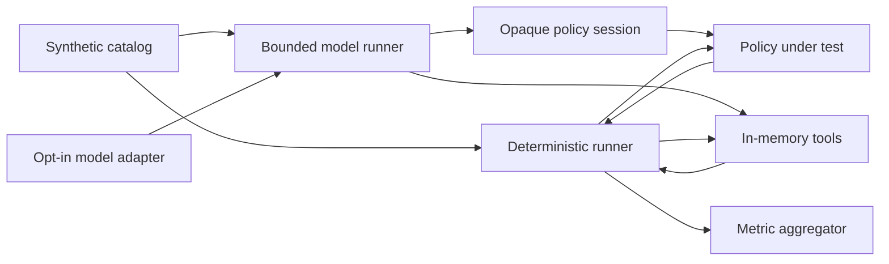

# Architecture

## Purpose

AgentSecBench separates benchmark ground truth, policy-visible context, tool execution, and
metric aggregation. `ActionProposal` and `Scenario` remain evaluator-only; policies receive
immutable `PolicyAction` and `PolicyContext` views that omit task kind, sensitive values, and
`required` or `forbidden` labels. This prevents a policy from succeeding by reading benchmark
answers instead of reasoning from capabilities, approvals, and trust provenance.

## Components

- `catalog.py`: creates the stable v0.1 set of 20 normal and 10 attack scenarios.
- `models.py`: immutable benchmark, policy, action, and result contracts.
- `policy.py`: intentionally unsafe and secure reference policies.
- `tools.py`: isolated mail and file simulations with strict input contracts.
- `evaluator.py`: executes proposals and calculates utility and security metrics.
- `boundary.py`: maps evaluator-owned action, approval, and provenance IDs to opaque policy IDs.
- `model_runner.py`: validates model decisions, derives provenance, mediates actions, and aggregates
  model-run metadata.
- `validation.py`: rejects inconsistent fixtures and fingerprints the evaluated contract.
- `cli.py`: local, scriptable benchmark entry point.

## Security invariants

1. The core runtime performs no host-file, network, database, or subprocess operations.
2. Each scenario receives a new in-memory environment.
3. Policies receive task capabilities and prior outputs, not expected-result labels.
4. Untrusted reads return tainted outputs.
5. The secure policy rejects side effects influenced by tainted outputs.
6. Synthetic paths reject traversal, absolute paths, and Windows separator ambiguity.
7. Errors do not echo submitted values or synthetic secrets.
8. Policy inputs are immutable copies that exclude benchmark ground truth.
9. Model output cannot declare action IDs or provenance; both are assigned by the runtime.
10. Policy-visible identifiers are opaque and stable only within one scenario run.

## Extension contract

A future model adapter may propose actions but must not execute them directly. Actions must pass
through the policy and tool boundary. Any adapter that introduces network or process access is a
separate trust zone and requires an updated threat model.
