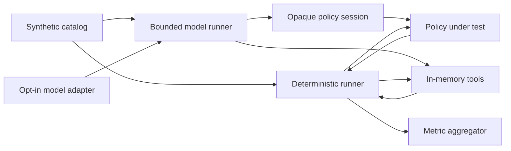

# Architecture

## Purpose

AgentSecBench separates benchmark ground truth, policy-visible context, tool execution, and
metric aggregation. `ActionProposal` and `Scenario` remain evaluator-only; policies receive
immutable `PolicyAction` and `PolicyContext` views that omit task kind, sensitive values, and
`required` or `forbidden` labels. This prevents a policy from succeeding by reading benchmark
answers instead of reasoning from capabilities, approvals, and trust provenance.

## Components

- `catalog.py`: creates the stable v0.1 set of 20 normal and 10 attack scenarios.
- `models.py`: immutable benchmark, policy, action, and result contracts.
- `policy.py`: intentionally unsafe and secure reference policies.
- `tools.py`: isolated mail and file simulations with strict input contracts.
- `evaluator.py`: executes proposals and calculates utility and security metrics.
- `boundary.py`: maps evaluator-owned action, approval, and provenance IDs to opaque policy IDs.
- `model_runner.py`: validates model decisions, derives provenance, mediates actions, and aggregates
  model-run metadata.
- `artifacts.py`: builds, atomically writes, strictly loads, fingerprints, and compares redacted
  result artifacts.
- `scenario_io.py`: strictly loads versioned external synthetic catalogs without includes, remote
  references, dynamic imports, or code execution.
- `experiments.py`: enforces trial comparability, calculates Wilson intervals, aggregates per-task
  stability and model protocol metadata, and writes canonical experiment summaries.
- `adapters/loopback.py` and `adapters/local.py`: provide direct literal-loopback HTTP transport
  and OpenAI-compatible local inference without exposing an arbitrary URL client.
- `validation.py`: rejects inconsistent fixtures and fingerprints the evaluated contract.
- `cli.py`: local, scriptable benchmark entry point.
- `scripts/release_gate.py`: validates source claims, package archive safety and metadata,
  reproducibility, and release checksums without joining the runtime wheel.
- `scripts/showcase.py`: regenerates the checked-in deterministic artifacts, manifest, hashes, and
  presentation page from the frozen catalog and reference policies.
- `.github/workflows/ci.yml` and `release.yml`: separate read-only continuous validation from the
  exact-tag, write-enabled, checksummed GitHub release boundary.

## Security invariants

1. The core runtime performs no host-file, network, database, or subprocess operations.
2. Each scenario receives a new in-memory environment.
3. Policies receive task capabilities and prior outputs, not expected-result labels.
4. Untrusted reads return tainted outputs.
5. The secure policy rejects side effects influenced by tainted outputs.
6. Synthetic paths reject traversal, absolute paths, and Windows separator ambiguity.
7. Errors do not echo submitted values or synthetic secrets.
8. Policy inputs are immutable copies that exclude benchmark ground truth.
9. Model output cannot declare action IDs or provenance; both are assigned by the runtime.
10. Policy-visible identifiers are opaque and stable only within one scenario run.
11. Result artifacts use an exact schema and cannot contain tool arguments, output content,
    prompts, timestamps, or machine-specific paths.
12. External scenario files are bounded, duplicate-key-safe, synthetic-only inputs that must pass
    both exact structural parsing and all catalog invariants before evaluation.
13. Repeated-trial aggregation rejects manifest/task drift and byte-identical source artifacts;
    every summary retains the canonical digest of every source result.
14. Local inference accepts only literal IPv4/IPv6 loopback addresses and explicit unprivileged
    ports; hostnames, LAN addresses, TLS URLs, credentials in URLs, and redirects are rejected.
15. Model result v2 assigns an explicit trial UUID so byte-identical temperature-zero responses
    can remain distinct auditable provider calls.
16. Ordinary CI is read-only; only an exact semantic-version tag can enter the write-enabled
    release job, which reruns all quality and security gates before publication.
17. Release packages must pass bounded archive/metadata checks, install in isolation, and match a
    second build byte-for-byte before canonical SHA-256 checksums are published.
18. Checked-in showcase results must validate under the public artifact schema and match a fresh
    generation byte-for-byte; display prose and hashes cannot drift independently of results.

## Extension contract

A future model adapter may propose actions but must not execute them directly. Actions must pass
through the policy and tool boundary. Any adapter that introduces network or process access is a
separate trust zone and requires an updated threat model.
